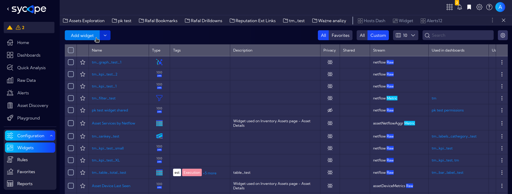
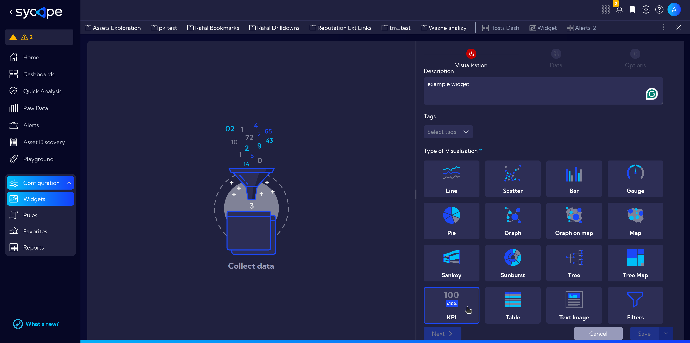
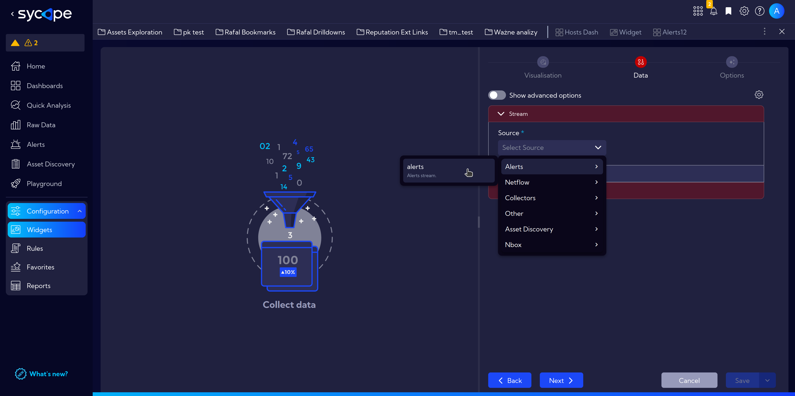
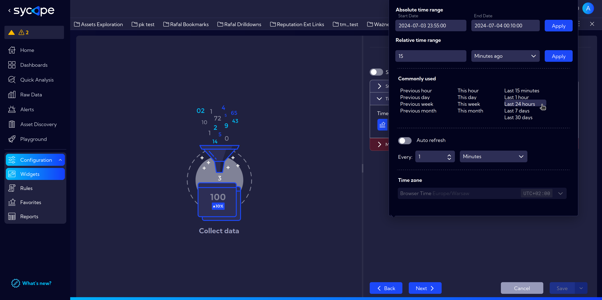
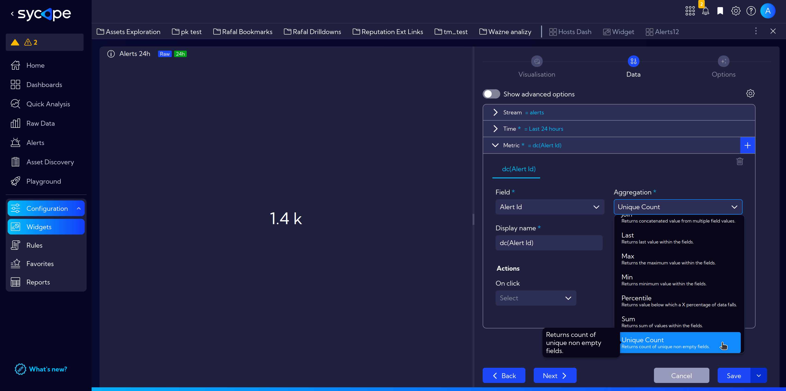
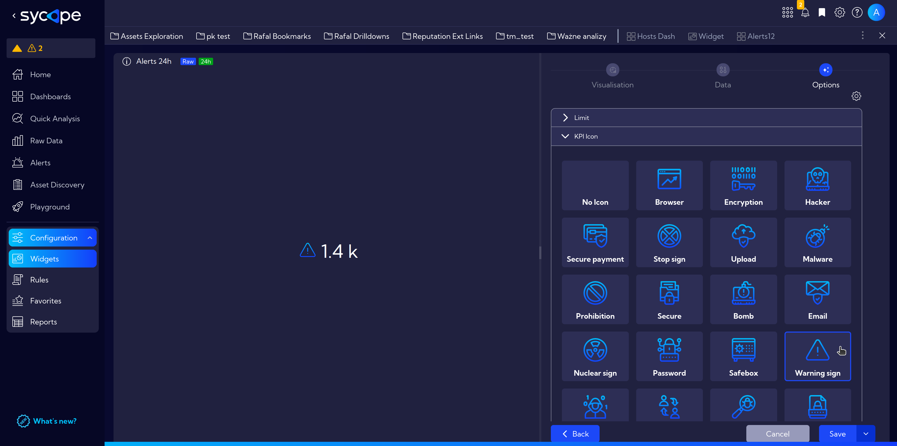
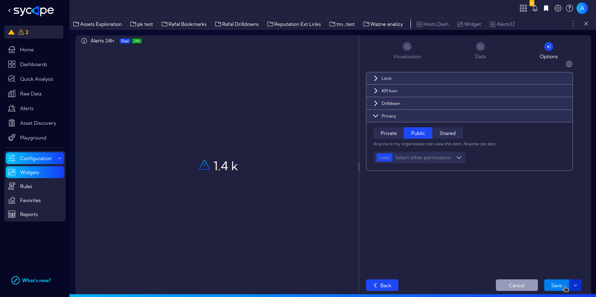

# Widget Example: Alerts in the last 24 hours

Below is an example of creating a widget.  
Our initial assumption is that we want to create a widget showing the number of **security incidents in the last 24 hours**.

To create a new widget, go to the menu and navigate to **`[Configuration > Widgets]`** and click on the **`Add widget`** button.

In the widget creation window, in the `Visualization tab` on the right fill in basic information: **Title** and **Description**, **Tags** and then scroll down and select the **Type of Visualization**.

Proceed further to the `Data tab`.  
Select the appropriate data stream that contains necessary information. In this case: `Source > Alerts > alerts`.

For the time range, select a 24-hour interval: `Last 24 hours`.

In the drop-down menu **Metrics**, to calculate the number of generated alerts, select the appropriate aggregation method.  
In **Field** select `Alert Id` and in **Aggregation** `Unique Count`.  

At this stage, we already have the simplest widget showing the number of alerts in the last 24 hours, which we will soon use when creating our own **Dashboard**.  

In the meantime, go to the `Options tab` and check a few more options.

Select the `Warning Sign` from the **KPI Icons** expander menu.

Adjust permissions in the **Privacy** expander menu and finally, click **`Save`** button in the lower-right corner.

:::tip
Now we can move on and create a more [advanced widget](/Examples/Widget-Example-Advanced).
:::
