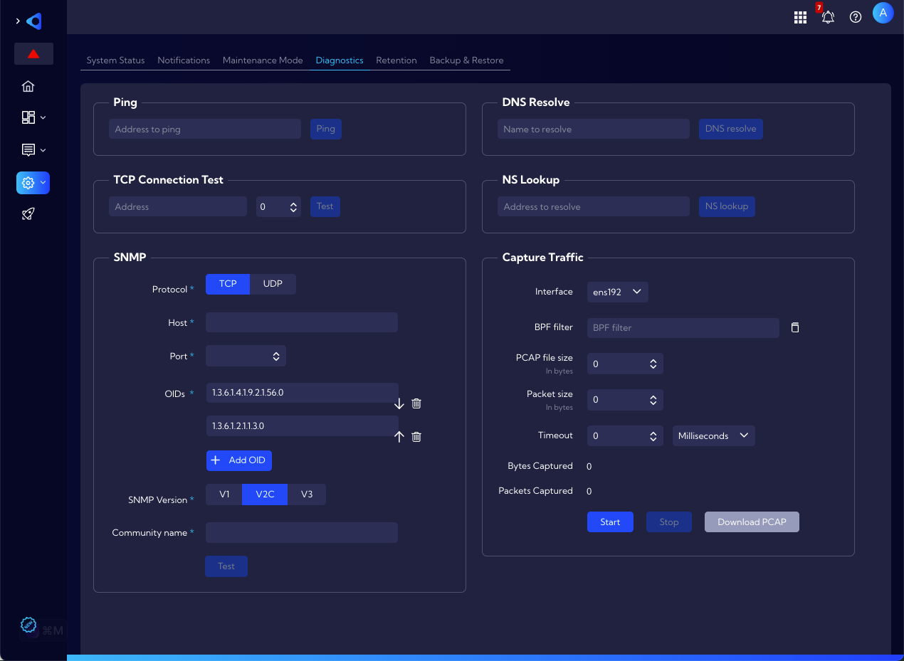

# Troubleshooting

This document describes tools and actions you can use when the System or its components malfunction.

## System services

You can check the operation status of individual services in the **[Settings > Support & Diagnostics > System Settings > System Status]** menu, in the **Services** section.

In addition to checking the operation status of a particular service, here you can `Restart` the service and `Stop` some services.

| Service name                 | Description                                                  |
| ---------------------------- | ------------------------------------------------------------ |
| `sycope-datastore.service `  | Sycope Datastore Backend - main collection, deduplication and processing service. Available directly through an API (GUI is using it). |
| `sycope-licensemgmt.service` | Sycope License Management Service - service responsible for license enforcement, updates and update server communication. |
| ` snmpd.service`             | Simple Network Management Protocol (SNMP) Daemon - SNMP service responsible for OS performance monitoring and providing metrics to third-party SNMP clients. |
| `sycope-feeds.service`       | Sycope - Feeds installer -                                   |
| `sycope-mgmt.service`        | Sycope - OS Management Daemon - a low-level API designed to handle basic OS configuration changes like IP change, service restart etc. |
| `sycope-proxy.service`       | Sycope Proxy Service - middleware service between web GUI and OS. |
| `sycope-gui.service`         | Sycope GUI Service - Sycope main GUI.                        |
| `sycope-console.service  `   | Sycope Local Console Service - Vmware client local web console service designed for initial IP configuration and basic troubleshooting in case of a main GUI issue. |

## Remote support access on demand

In case of problems with the System, you can ask the Sycope support team for help and give them safe and simple access to the Sycope system using the [Remote Support](/User-Guide/Settings/Support-and-Diagnostics/Remote-Support) functionality.

## System logs

Log generation functionality is built into the Sycope system. This option is located in the **[Settings > Support & Diagnostics > System Settings]** menu in the System logs section and can help you solve problems with the System.

To generate logs, use the `Generate logs` button. The generated log file will appear in the list and at the same time will be downloaded by the browser to a local disk. The file with logs is packed in ZIP format.

In the file you will find logs that refer to:
- Authentication,
- Network,
- SSH access,
- System,
- Services.

## Specific problems

The following are the simplest suggestions for problems with specific areas of the System.

### GUI problems

When you encounter GUI issues, you can utilize `.har` (HTTP Archive) files to troubleshoot problems by providing a detailed log of their interaction with the Sycope system to the support team. A `.har` file, or HTTP Archive format, is a JSON-formatted archive file format for logging of a web browser's interaction with an application. The ".har" file format is often used to analyze the performance of web pages by inspecting the web requests and responses, which could be particularly useful for identifying performance bottlenecks, troubleshooting network issues, or analyzing the behavior of websites.

These `.har` files enable support to observe the network traffic between the client's browser and the server, which can be essential for identifying and resolving issues.

#### Generating a `.har` File:

1. **Open the Developer Tools in your Browser:**
   - Navigate to the web page where the issue is occurring.
   - Right-click and select “Inspect” or use shortcut keys (e.g., `Ctrl+Shift+I` or `Cmd+Opt+I` on Mac).
2. **Navigate to the Network Tab:**
   - Once in the Developer Tools section, click on the “Network” tab.
3. **Reproduce the Issue:**
   - Ensure the recording is enabled (a red circle or dot indicates recording). If it is not, click on the record button.
   - Refresh the page or navigate as needed to reproduce the issue, ensuring all relevant network activity is captured.
4. **Save the `.har` File:**
   - Right-click on any entry in the network activity panel and select “Save all as HAR with content” or a similar option.
   - Save the `.har` file to a known location on your computer.

### Object problems

In case of problems with the System objects such as **Widgets**, **Rules**, **Lookups**, etc. you can export them to a **.json** file and then check them on another instance of the System or send them to the Sycope support team for checking.

### NQL query problems

If you have problems with NQL queries use the [Palyground](/User-Guide/Playground) functionality to test queries. Take a look at our documentation in the **NQL section** and especially in the [NQL User Manual](/NQL/NQL%20documentation) and [NQL query examples](/NQL/NQL_examples)

### Traffic-related problems

In case of network traffic problems in the first place, you can use the **Capture traffic** tool **[Settings > Support & Diagnostics > Diagnostics]** to generate network traffic on the selected interface and save it in a **.pcap** file. Other diagnostic tools available in this menu are described in the section below. 

Such recorded traffic can be analyzed in analysis tools such as **Wireshark** or sent to the **Sycope support team** for checking.

## Diagnostics tools

In the **[Settings > Support & Diagnostics > Diagnostics]** menu there are several diagnostic tools that you can use to troubleshoot the problem.

The available tools:

- **Ping** - simple ping connection test
- **TCP Connection Test** - telnet connection to the selected address on the selected port
- **SNMP** - SNMP ver. 1/2/3 connection test
- **DNS Resolve** - a tool to resolve an individual hostname to an IP address
- **NS lookup** - a tool to resolve an IP address to an individual hostname
- **Capture Traffic** - a tool to capture packets from a selected network interface 

