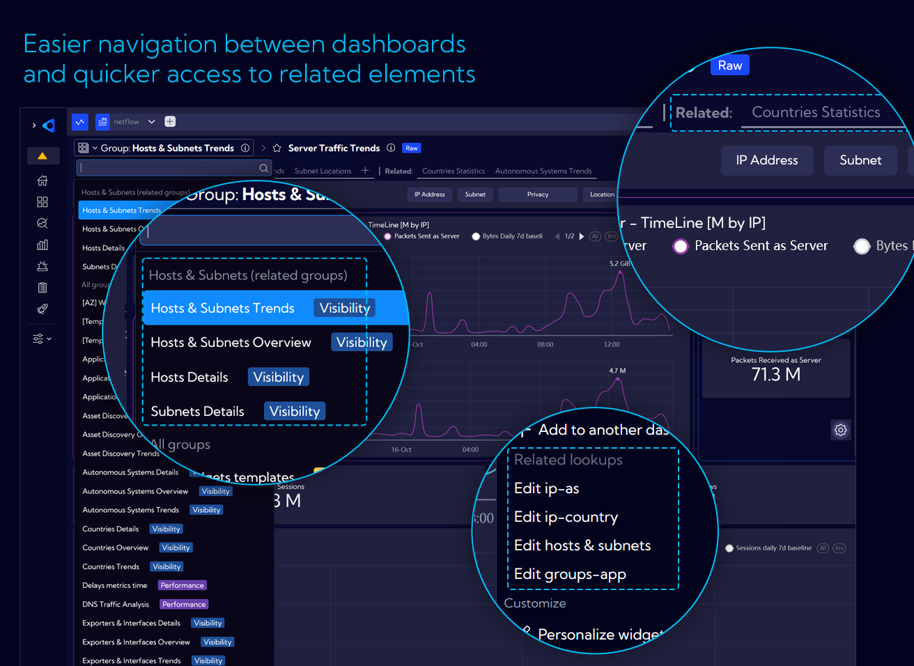

# Release Notes

## ver. 3.0

### Built-in Content

Sycope 3.0 is first and foremost a huge number of new built-in views for data analysis organized into three categories:
- **Trends** category allow for finding certain patterns, peaks and lows in different statistics over time. They are designed to work with different time ranges such as days, weeks or even months and calculate trends in real time.
- Dashboards in **Overview** include counters for different scenarios and charts with Top limitations, in order to focus on the most important sources. This category was designed with a specific point in time in mind – periods of 15-60 minutes.
- **Details** provide answers to specific questions and problems and allow you to view NetFlow level data about specific objects.

### Containers

We created new main view for selecting dashboard groups, designed with the concepts of categories, entities and licenses in mind so that you can quickly find what you are looking for. New built-in content in following sections is presented:  Visibility & Performance, Probe (L7 Packet Inspection), Security, Asset Discovery, System and Custom.

This is the main entrance to the system, and we encourage you to go through it both at the start of your analysis and at any other time.

### Easier navigation between dashboards and quicker access to related elements

Although the main view is clear and convenient, Sycope provides other paths to get directly to the destination: related groups, related dashboards.

By clicking on the group name, you will find a list of related groups of dashboards first. Additionally, we display quick links to dashboards that are related to the group you are currently viewing.

### Easier navigation between dashboards and quicker access to related elements

Although the main view is clear and convenient, Sycope provides other paths to get directly to the destination: related groups, related dashboards.

By clicking on the group name, you will find a list of related groups of dashboards first. Additionally, we display quick links to dashboards that are related to the group you are currently viewing.

### More options in context menu for better navigation and analysis

The context-menu, which appears when you click on a specific object, is a multi-purpose tool with dynamically changing content based on the type of the object you clicked on.

Drilldown enables contextual analysis by capturing a clicked value, displaying it on another dashboard, chart, or even an external link, often including a built-in filter.

Now you can easily use the built-in content for specific types of objects and navigate between drilldown options in the context menu.

### More options in context menu for better navigation and analysis

The context-menu, which appears when you click on a specific object, is a multi-purpose tool with dynamically changing content based on the type of the object you clicked on.

Drilldown enables contextual analysis by capturing a clicked value, displaying it on another dashboard, chart, or even an external link, often including a built-in filter.

Now you can easily use the built-in content for specific types of objects and navigate between drilldown options in the context menu.

### It is now easy to put the KPIs in context

**KPI** is a commonly used widget that is great for an overview and taking a quick glance at the dashboard. However, we believe that it should be more than just a number. In our new built-in content, all KPIs will provide more in-depth information about the data behind them by showing how specific values change over time or by highlighting other important data, depending on what is most useful in a given context.

### Historical baselines as reference values

Getting the data you need is the first step to solve any problem. The values we see are frequently meaningless without a context – for example, a historical perspective. Sycope provides multiple ways to automatically access and use reference points based on historical data – **baselines**. To make it even more accessible, most built-in chart widgets include pre-configured baselines for timelines, which can be visible with a click of a button.

### Even quicker and better configuration

We continue to improve our **Quick Setup** process to make it faster in defining valuable information about your network, hosts and applications, in order to take a full advantage of flow data with business, location or severity contexts.

Our **Quick Setup** wizard now provides suggestions and auto-completion, where applicable, based on already collected flows and saved configuration.

The data can also be imported in CSV format by using prepared templates as a starting point.

### Smart calcualtor for easier retention configuration

Configuration of data retention parameters is vital for system performance. To make it easier our Quick Setup wizard now **dynamically calculates** usage and space requirements based on current rate of flow data and theoretical usage as per the license limit. This will help you in defining the retention values to maximize performance and fully use the available space.

### Others

Save local filters in user preferences

Add suggestion overlay when changing streams

Add simple dashboard frames

Add deprecated annotation

Display baseline on KPI

Change KPI click action to drill-down

Add by-value coloring for KPI and table

Add toggle for log scale in chart toolbox

Add dynamic baseline time range

Enable server-side sorting for all widget tables

Add related groups and related dashboards

Enable adding/removing dashboards to/from groups directly in the dashboard list

Add deprecated section to dashboard group dropdown menu

Add inverted table view

Add new units data formatter:
- Auto-calculated decimal and binary bits and bits per second (b/s and ib/s)
- Auto-calculated decimal and binary bytes and bytes per second (B/s and iB/s)
- Flows per second (flows/s)

Add option to edit lookup values from widget settings

Add map chart with multiple metrics

Add suggested fields in Quick Setup (group, latitude, longitude)

Add exporters section to Quick Setup

Add ability to double-click on chart legend to show only the selected data series or object

Enable search by tag name in tables

Refactor color picker, add gradient picker, support single color definitions, and allow gradient by threshold

Implement "Add and Import" dashboard from group
Add "not enough data" message to filters

Add support for deprecated objects

Update "not enough data" condition in visualization filter

Add additional legend options for grid charts

Load queries based on selected legend metrics

Enable open ranges in range-based coloring

Add option to reset domain names in Asset Discovery module

Add assets retention configuration to Quick Setup

Enable editing of Traffic Profile from context menu

Secure Asset Discovery view by license

Add export options ("Export All" and "Export Sample") to asset traffic rules

Enable filtering between assetNetflowAggr and assetDevices

Set maximum table limit to 5000

Round previous week and previous month data to UTC for bucket optimization

Set default stream in personal settings

Expand features of filter widget

Add '...' button for horizontal filters in dashboard

Enable auto-formatting for duration values

Extend rich text component to support tile widget creation (e.g., link handling)

Add in-built lookup validation

Add support for various system messages, such as query queue overflow notifications

Enable permission delegation for object and role editing

Save state (open/closed) of the statistics window in raw data view and dashboards

Apply navigational changes, e.g., updating locations of macros, shortcuts, and filters

Enable reordering of items in lists (e.g., bookmarks and favorite filters)

Allow defining column profiles in tables separately for each data stream

Enhance functionality for adding and editing objects, lists, and groups across the system

Improve widget types, including tree map, graph, scatter plot, sunburst, heatmap, trajectory, and filter widgets

Fix background color for tables

Correct suffixes (sec and min)

Fix metric bar color

Correct retention disk size calculation

Validate files properly in Firefox

Save table state in user preferences and fix column resizing when a minimum width is set
