## 1. Performance

DDoS attacks (Distributed Denial of Service) are currently among the most popular and most simple attacks used by cybercriminals. Their goal is to disrupt the network infrastructure or the running application – “the victim of the attack”, by sending massive amounts of data packets. This threat affects all service sectors on the internet. Modern attacks of DDoS require the use of thousands of devices organized into so-called botnets. DDoS attacks usually result in financial and image losses.

Thanks to an efficient algorithm using many network parameters, the FlowControl XND module is able to detect various types of DDoS attacks. This is due to the implemented ability to flexibly change network parameters depending on needs. *Table 1.1* contains examples of what parameter is important to detect a specific type of DDoS attack. All attributes are related to data for 1 minute, e.g. Bytes parameter means de facto BPM (Bytes per Minute).

 

| **DDoS Attack Type** | **Description**                                              | **Important FlowControl  paramaters**                        |
| ----------------------------- | ------------------------------------------------------------ | ------------------------------------------------------------ |
| **Volume attack**             | An attack saturating the victims link capacity.              | ●     Bytes <br />●     Bytes_Limit  (In case of UDP Flood attacks, the following parameters should also be considered: IP, IP Ex, ASN, BPF.) |
| **Protocol attack**              | An attack consuming actual server resources or  intermediate communication equipment such as firewall, IDS, or switch. | ●     Packets                                                |
| **Application layer  attack** | An attack causing the web server to crash.                   | ●     Flows                                                  |

*Table 1.1 Examples of* *XND module parameter control*

 

 

## 2. FlowControl XND Module

 

### 2.1 Introduction to XND Module

​	The FC XND module uses aggregated NetFlow, sFlow, NSEL data. Based on this data and parameters entered by the user, the algorithm calculates a set of data defining the target together with the attacked service and can then take action to limit the effects of the attack. DDoS attacks are detected by the XND module algorithm based on the parameters: static thresholds and dynamic thresholds.

**Static thresholds** are used to optimize and reduce the number of False Positives by filtering network traffic that do not meet quantitative parameters such as: bytes limit, packet limit or unique source IP addresses. All static threshold parameters have to be exceeded in order for the algorithm to start the next step, i.e. calculation of dynamic threshold parameters.

**Dynamic thresholds (behavioral)** are used to compare current network traffic characteristics with the previous sample (baseline). By default, a baseline is created for 15 minutes before the attack. The dynamic threshold parameters are configured in the XND module as a so-called multiplier, which means that multiple of a given indicator cannot be exceeded. The indicator parameter specifies the number of dynamic thresholds that must be exceeded for an attack to be confirmed from the behavioral analysis point of view. 

​	The DDoS mechanism also uses two types of whitelists: **ASN whitelist** and **service whitelist** **– monitoring mode**. The first one is used to define source ASNs to be ignored from the XND module algorithm calculation. The service whitelist, on the other hand, is used to define the services for which only DDoS alerts will be generated, and blocking will not be triggered for them using the BGP FlowSpec protocol or RTBH (Remote Triggered Black Hole Routing).

​	All parameters of the DDoS detection algorithm are configured in relation to the **function group (Settings/Mapping/Groups/Function),**  *Fig. 2.1.1.* Here the resources subject to the procedure contained in the XND module are configured, thus it is possible to fine-tune the XND module mechanism.


 

*Fig. 2.1.1 XND groups configuration parameters*


### 2.2 XDN module operation diagram

The *Fig. 2.2.1* shows the operating principle and the individual analysis steps contained in the FlowControl XND module as a diagram.

 

 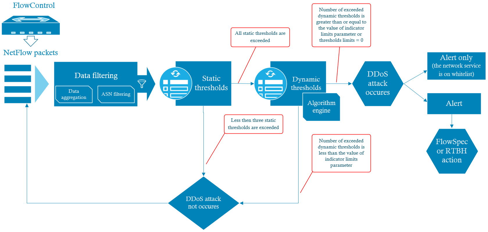


*Fig. 2.2.1 Concept of the DDoS algorithm implemented in XND module*  

 

### 2.3 Data filtering

​	One of the first operations performed by the XND module on input data strings is pre-filtering. Its task should be filter out redundant motion for the analysis algorithm before the grouping process. 

Pre-filtration includes:

1. Target host filtering - filters the target IP addresses of monitored resources. These addresses are configured using function groups defined in the Engine Parameters.
2. TCP client traffic filtering – used to filtering the incoming traffic to the monitored resource, which is a response to queries to external resources. This step is implemented in the FlowControl system engine.
3. Source ASN filtering – defines ASNs that are excluded from analysis by the XND Module algorithm.

 

### 2.4 Data Grouping

​	Another activity carried out by the XND module is the network traffic aggregation, i.e. data grouping. This operation is necessary to calculate a set of parameters that determine the target with the attacked service. In this process the following indicators are calculated:

1.   Unique IP addresses
2.   Unique ASNs
3.   Unique internal IP addresses
4.   Unique public IP addresses
5.   Flow counter 
6.   Number of packets
7.   Number of bytes
8.   PPF (Packets per Flow )
9.   BPP (Bytes per Packets)
10.  BPF (Bytes per Flow).   

For a DDoS attack, each set of parameters defining the target together with the service under attack, is a combination of such attributes as: target host, protocol, application and traffic direction. The set parameters defining the target together with the service is **DDoS destination attack identifier (DDA Id).**


### 2.5 Static thresholds

​	The static threshold parameters are represented by the following limits: flow limit, byte limit, and unique IPs limit – *Table* *2.5.1.* They allow data selection for the analyzed sample in order to determine which data will be taken into account in further steps in the algorithm. At this stage pre-filtered network traffic from the last minute is filtered using the above mentioned limits. In case all static thresholds for a specific DDA Id are exceeded, the XND module algorithm goes to the dynamic parameters analysis procedure. In other cases the algorithm performs filtering with static thresholds for the traffic sample from the next minute.

 

| **Static Threshold** | **Description**                                              |
| -------------------- | ------------------------------------------------------------ |
| **Flows Limit**      | Minimum number of network flows related to DDA Id.           |
| **Bytes Limit**      | Minimum number of bytes related to DDA I expressed in [MB].  |
| **Unique IPs Limit** | Minimum number of unique source IP addresses related to DDA Id. |

*Table 2.5.1 Static threshold parameters.*


​	Values of the static threshold parameters are configured in the Engine Parameters tab as shown in *Fig. 2.5.2.*


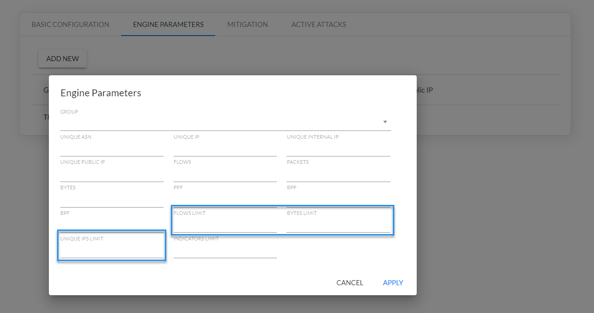

 *Fig. 2.5.2 Static threshold parameters configuration* 

 

 

### 2.6 Dynamic thresholds

​	Ten dynamic thresholds and indicator limits are implemented in the FC XND module. They are described in *Table 2.6.1*.    


| Dynamic Thresholds         | **Description**                                              |
| -------------------------- | ------------------------------------------------------------ |
| **Unique ASNs**            | Number of unique ASNs related to DDA ID.                     |
| **Unique IPs**             | Number of all unique source IP addresses (external and internal) related to DDA ID. |
| **Unique Internal IPs**    | Number of all unique source internal IP addresses related to DDA Id. Internal (private) addresses are configured in the Settings/Mapping/Groups/Internal tab. |
| **Unique Public IPs**      | Number of all unique source external IP addresses related to DDA Id. |
| **Flows**                  | Number of flows related to DDA ID.                           |
| **Packets**                | Number of packets related to DDA ID.                         |
| **Bytes**                  | Number of bytes related to DDA ID.                           |
| **PPF (Packets per Flow)** | Number of packets per network flows calculated as sum of packets divided by sum of network flows in context of DDA ID. |
| **BPP (Bytes per Packet)** | Number of bytes per packet calculated as sum of bytes divided by sum of packets in context of DDA Id. |
| **BPF (Bytes per Flow)**   | Number of bytes per flows calculated as sum of bytes divided by sum of the flows in context of DDA Id. |
| **Indicator Limit**        | Threshold – specifies the number of threshold limit parameters that must be exceeded for the algorithm to consider the analysis to be positive. |

*Table 2.6.1 Dynamic threshold parameters* 

 

The value of the **Indicator Limit** controls parameters determining how many dynamic parameters must be exceeded for the algorithm to consider the analysis to be positive.

***Example:***  *“Indicators limit = 2” - this means that only two out of ten parameters of the dynamic threshold limits listed in Table 2.6.1 are exceeded for the algorithm to give a positive result.*


> **Note**: for the parameter “Indicators limit =0” the algorithm for dynamic analysis always gives a positive result!


​	Values of the dynamic threshold parameters from are configured in the Engine Parameters tab as shown in *Fig. 2.6.1.*

 

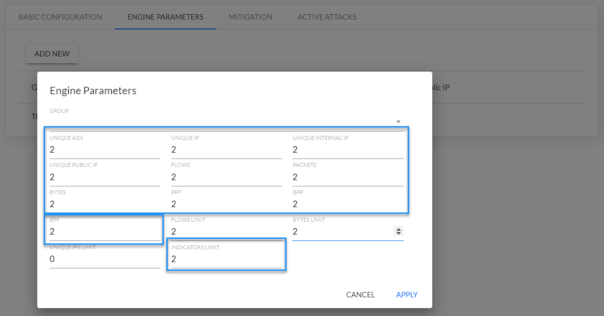

*Fig. 2.6.1 Dynamic threshold parameters configuration* 

 

​	Dynamic threshold parameters are calculated using analysis behavioral mechanism for defined function groups. This mechanism uses data from time intervals preceding the analyzed sample - so-called reference data. This is base data which is used to calculate average values for a set of metrics necessary to detect DDoS attacks. A reference data is data averaged from the last fifteen minutes preceding the analyzed sample. This is used in the comparison process with the analyzed data to calculate dynamic threshold parameters. *Fig. 2.6.2* shows time intervals used to calculate dynamic threshold parameters. 


*Fig. 2.6.2 Time intervals for determining reference and analysed data*

 

The dynamic thresholds during an ongoing attack are calculated by the algorithm in a different way than at the beginning of the attack. In such a case the value of each dynamic threshold parameter exceeded must be less than half of the threshold value set by the user for it to be treated as an unexceeded parameter.


---

> **NOTE:**
>
> **For the DDoS algorithm to work correctly, you must set the values for all Engine Parameters, both static *(Fig. 2.5.2)* and dynamic *(Fig. 2.6.1).***

---

 

### 2.7 XND module response to the DDoS attacks

​	In the next step of the algorithm implementation, depending on the configuration of the XND module, one of two actions can take place according to *Fig. 2.2.1*:

1. Generating an alarm and block the offending traffic on routers using FlowSpec or RTBH functionality.
2. Generating an alarm only if the service has been entered on the service whitelist.

 

## 3. DDoS Mitigation

​	

​	The FlowControl system in the XND module supports two features to mitigate DDoS attacks: FlowSpec and RTBH (Remotely Triggered Black Hole). Both require routers that support BGP protocol and optionally FlowSpec feature. When FlowControl detects an attack, it sends a command to the edge router(s) of the organization to block the offending traffic. Depending on the feature used, this command can be a filtering rule to place in an internal FlowSpec table or regular route to inject in the routing table. Both mechanisms work in similar way as depicted on the *Fig. 3.1*.


 

*Fig. 3.1 DDoS attacks mitigation diagram*

​	

​	The FlowControl system establishes BGP sessions with edge routers (green dotted arrows in the figure) that send Flow packets to FlowControl. Additionally, FlowSpec can be configured on routers that support this feature (see the following section for FlowSpec enabled router models). Depending on the feature used, FlowControl sends the following information to routers:

- FlowSpec: attacked server IP address and TCP port. Routers uses this information to filter out unwanted traffic directed to specified IP address and TCP port.
- RTBH: attacked server IP address and a special, non-existent “black hole” IP address, e.g. 192.0.2.1. Routers use both addresses to update their routing tables and to re-direct all the traffic, both legitimate and offending, to the black hole instead to the destination server. Additional static route is required on routers that directs all packets with black-hole destination address (192.0.2.1 in this case) to null or discard interface.

​	Both FlowSpec and RTBH mitigate attacks, but in latter case the attacked server is completely unavailable, i.e. cannot be reached via SSH or remote desktop. Once the attack stops FlowControl sends commands to routers to remove previously applied FlowSpec filters or RTBH routes and restore normal communication. Only one mitigation mechanism i.e. FlowSpec or RTBH can be used at a time, not both. Additionally, FlowControl sends to the router RTBH next-hop addresses with well-known NO_EXPORT and 666 communities. Detailed information on FlowSpec functionality is available in RFC 5575 "Dissemination of Flow Specification Rules" at https://tools.ietf.org/html/rfc5575. For RTBH see RFC “Remote Triggered Black Hole Filtering with Unicast Reverse Path Forwarding (uRPF)”, https://tools.ietf.org/html/rfc5635.


> The prerequisite for the activation of the above described functionality is the support of FlowSpec protocol by network devices. This information can usually be found in the documentation of the device. The following describes how to configure FlowSpec for Juniper and Cisco devices.


### 3.1 FlowSpec configuration on Juniper

​	The FlowSpec protocol is supported by Juniper MX series routers. Below is example configuration for Juniper devices. The FlowControl system server is assumed to have the following IP address 192.168.0.100 and BGP number AS 65100.


```
protocols {

  bgp {
    group flowcontrol {
      family inet {
        flow {
          no-validate NO-VALIDATION;
        }
        any;
      }
      neighbor 192.168.0.100 {
        description Server FlowControl;
        peer-as 65100;
      }
    }
  }
}

policy-options {
  policy-statement NO-VALIDATION {
    term 1 {
      then accept;
    }
  }
}
```

>**Warning !**
>
The NO-VALIDATION policy causes all IP addresses sent by FlowControl to be placed in the FlowSpec table (inetflow.0), regardless of whether they are in the routing table or not. Its use is not mandatory, but it makes easier to diagnose possible BGP communication problems between FlowControl and the router.


#### 3.1.1 Verifcation of BGP session between FlowControl and the router

```
admin@MX> **show bgp summary**
Groups: 1 Peers: 2 Down peers: 0

...

Peer           AS   InPkt   OutPkt  OutQ  Flaps Last Up/Dwn State|#Active/Received/Accepted/Damped...

**192.168.0.100     65100     1     0    0    0      0 Establ**
 inet.0: 0/0/0/0
 inetflow.0: 0/0/0/0

...

```


#### 3.1.2 Checking the FlowSpec table on the router

The following example shows the contents of the FlowSpec table (inetflow.0) after FlowControl has sent to the router a rule to block attack on the destination IP address 192.160.20.1 and destination TCP port 53:


```
admin@MX> **show route table inetflow.0 detail**   

inetflow.0: 1 destinations, 1 routes (1 active, 0 holddown, 0 hidden)
**192.168.20.1,\*,dstport=53**/term:1 (1 entry, 1 announced)
    *BGP  Preference: 170/-101
…
        Communities: **traffic-rate:0:0**
…

```


### 3.2 FlowSpec configuration on Cisco ASR 9000 devices

Below is a sample configuration of the ASR 9000. It is assumed that the FlowControl system has the following IP address: 192.168.0.100 and  BGP AS 65100.


```router bgp 65100
 bgp router-id 192.168.0.50
 address-family ipv4 unicast
 !
neighbor 192.168.0.100
 remote-as 65100
 !
 address-family ipv4 flowSpec

  route-policy FlowControl in
  validation disable
 !
 !
!
route-policy FlowControl
 done
end-policy
!

flowspec

 local-install interface-all

!
```

> Notes:
>
>1. The IOS-XR system requires the definition of filtering policies for routes (IP prefixes) sent and received by the BGP process. In this case, FlowControl policy has been defined which accepts all routes (done command). It is applied in the incoming direction (route-policy FlowControl in command) in the address-family ipv4 flowspec section, which means that the router accepts all FlowSpec rules sent by FlowControl.
>2. The validation disable command causes the router to accept all IP addresses sent by FlowControl, regardless of whether they are in the routing table or not. The use of this command is not mandatory, but it is recommended because it makes easier to diagnose possible BGP communication problems between FlowControl and the router.
>3. The flowspec local-install interface-all command enables FlowSpec protocol support on all interfaces.

 


#### 3.2.1 Verification of the BGP session between FlowControl and the router


```
RP/0/RP0/CPU0:ASR9000#**show bgp neighbor brief**
Wed Jul 22 09:35:06.619 UTC

Neighbor    Spk  AS Description             Up/Down NBRState

**192.168.0.100   0 65100                   00:03:32 Established**

RP/0/RP0/CPU0:ASR9000#
```


#### 3.2.2 Checking the FlowSpec table on the router

The following example shows the contents of the FlowSpec table after FlowControl has sent to the router a rule to block attack on the destination IP address 192.160.20.1 and destination TCP port 53:

```
RP/0/RP0/CPU0:ASR9000#**show flowSpec afi-all**
Wed Jul 22 09:38:20.791 UTC

AFI: IPv4

 **Flow      :Dest:192.168.20.1/32,DPort:=53/2**
  Actions   :**Traffic-rate: 0 bps** (bgp.1)
RP/0/RP0/CPU0:ASR9000#

```


### 3.3 FlowSpec configuration on Cisco CSR 1000v

Below is a sample configuration of the CSR 1000. It is assumed that the FlowControl system has the following IP address: 192.168.0.100 and BGP AS 65100.

```
router bgp 65100
 bgp router-id 192.168.0.50
 bgp log-neighbor-changes
 neighbor 192.168.0.100 remote-as 65100
 !
 address-family ipv4 flowspec
 neighbor 192.168.0.100 activate
 neighbor 192.168.0.100 validation off
 exit-address-family

flowspec

 local-install interface-all

```

>Notes:
>
>1.  The “neighbor x.x.x.x validation off” command instructs the router to accept all IP addresses sent by FlowControl, regardless of whether they are in the routing table or not.
>2.  The flowspec local-install interface-all command enables FlowSpec protocol support on all interfaces.


#### 3.3.1 Verification of the BGP session between FlowControl and the router


```
CSR1000V#**show ip bgp summary** 
BGP router identifier 192.168.0.50, local AS number 65100
BGP table version is 1, main routing table version 1

Neighbor    V      AS MsgRcvd MsgSent  TblVer InQ OutQ Up/Down State/PfxRcd

**192.168.0.100  4    65100    5    8    1   0  0 00:03:21    0**
```


#### 3.3.2 Checking the FlowSpec table on the router


The following example shows the contents of the FlowSpec table after FlowControl has sent to the router a rule to block attack on the destination IP address 192.160.20.1 and destination TCP port 53:
```
CSR1000V #**show bgp ipv4 flowspec detail** 
BGP routing table entry for **Dest:192.168.20.1/32,DPort:=53/2,** version 2
 Paths: (1 available, best #1, table IPv4-Flowspec-BGP-Table)
 Not advertised to any peer
 Refresh Epoch 1
 65100
  0.0.0.0 from 192.168.0.100 (192.168.0.100)
   Origin incomplete, localpref 100, valid, external, best
   Extended Community: **FLOWSPEC Traffic-rate:0,0**
   rx pathid: 0, tx pathid: 0x0
```


### 3.4 RTBH configuration on Juniper

Below is a sample configuration for Juniper devices. The FlowControl system server is assumed to have the following IP address 192.168.0.100 and BGP number AS 65100. Additionally the black-hole address is 192.0.2.1.

```
protocols {
  bgp {
    group flowcontrol {
    …
      neighbor 192.168.0.100 {
        description Serwer FlowControl;
        family inet {
          unicast;
        }
       peer-as 65100;
      }
    }
  }
}
routing-options {
  static {
    route 192.0.2.1/32 discard;
  }
}
```


#### 3.4.1 Verifcation of BGP session between FlowControl and the router

```
admin@MX> **show bgp summary**

Groups: 1 Peers: 2 Down peers: 0
...
Peer           AS   InPkt   OutPkt  OutQ  Flaps Last Up/Dwn State|#Active/Received/Accepted/Damped...

**192.168.0.100     65100     1     0    0    0      0 Establ**
 inet.0: 0/0/0/0
 inetflow.0: 0/0/0/0

...

```

 

#### 3.4.2 Checking the routing table on the router

The following example shows the contents of the routing table (inet.0) after FlowControl has sent to the router the black-hole IP address 192.0.2.1 as the next-hop for attacked IP address 192.168.20.1:


```
admin@vCP1> **show route table inet.0**
inet.0: 5 destinations, 5 routes (5 active, 0 holddown, 0 hidden)
\+ = Active Route, - = Last Active, * = Both

 192.0.2.1/32    *[Static/5] 00:12:05

           Discard

192.168.20.1/32  *[BGP/170] 00:00:35, localpref 100, from 192.168.0.100

          AS path: 65100 ?, validation-state: unverified
           to Discard
```


### 3.5 RTBH configuration on Cisco ASR 9000

Below is a sample configuration for Cisco ASR 9000 devices. The FlowControl system server is assumed to have the following IP address 192.168.0.100 and BGP number AS 65100. Additionally the black-hole address is 192.0.2.1
```
router static
 address-family ipv4 unicast
...
 192.0.2.1/32 Null0
 !
!

route-policy RTBH
 if source in (192.168.0.100/32) then
  done
 endif
end-policy

router bgp 65100
 !
 neighbor 192.168.0.100
 remote-as 65100
...

 address-family ipv4 unicast
  route-policy RTBH in
 !
 !
!
```


>Notes:
>
>1. The IOS-XR system requires the definition of filtering policies for routes (IP prefixes) sent and received by the BGP process. In this case, RTBH policy has been defined which accepts all routes (done command). It is applied in the incoming direction (route-policy RTBH in command) in the address-family ipv4 unicast section, which means that the router accepts all routes sent by FlowControl.
>2.  Both FlowControl and the router must be in the same AS. The RTBH feature does not work if both devices are in different AS and establish eBGP connection.


#### 3.5.1 Verification of the BGP session between FlowControl and the router

```
 RP/0/RP0/CPU0:ASR9000#**show bgp neighbor brief**
Wed Jul 22 09:35:06.619 UTC

Neighbor    Spk  AS Description             Up/Down NBRState
**192.168.0.100   0 65100                   00:03:32 Established**
RP/0/RP0/CPU0:ASR9000#
```


#### 3.5.2 Checking the routing table on the router

The following example shows contents of the routing table after FlowControl has sent to the router the black-hole IP address 192.0.2.1 as the next-hop for attacked IP address 192.168.20.1. The routing table consists of two entries: static one that directs to Null0 interface traffic destined to 192.0.2.1 address, and the dynamic BGP entry that sets next-hop for the attacked IP 192.168.20.1 to the above IP address 192.0.2.1. Effectively all the traffic destined to IP 192.168.20.1 is directed to the Null0 interface, i.e. is dropped.

```
RP/0/RP0/CPU0:ASR9000#**show ip route**
…
**S  192.0.2.1/32 is directly connected, 01:50:10, Null0**
**B  192.168.20.1/32 [20/0] via 192.0.2.1, 00:55:23**
…
```


### 3.6 RTBH configuration on Cisco CSR 1000v

Below is a sample configuration for Cisco CSR 1000v devices. The FlowControl system server is assumed to have the following IP address 192.168.0.100 and BGP number AS 65100. Additionally the black-hole address is 192.0.2.1
```
router bgp 65100
 bgp router-id 192.168.0.50
 neighbor 192.168.0.100 remote-as 65100
 !
 address-family ipv4
 neighbor 192.168.0.100 activate
 exit-address-family
 !
ip route 192.0.2.1 255.255.255.255 Null0
```


>Notes:
>
>Both Flowcontrol and the router must be in the same AS. The RTBH feature does not work if both devices are in different AS and establish eBGP connection.

 

####  3.6.1 Verification of the BGP session between FlowControl and the router

```
CSR1000V#**show ip bgp summary** 
BGP router identifier 192.168.0.50, local AS number 65100
BGP table version is 1, main routing table version 1

Neighbor    V      AS MsgRcvd MsgSent  TblVer InQ OutQ Up/Down State/PfxRcd

**192.168.0.100  4    65100    5    8    1  0  0 00:03:21    0**
```


#### 3.6.2 Checking the routing table on the router

The following example shows contents of the routing table after FlowControl has sent to the router the black-hole IP address 192.0.2.1 as the next-hop for attacked IP address 192.168.20.1. The routing table consists of two entries: static one that directs to Null0 interface traffic destined to 192.0.2.1 address, and the dynamic BGP entry that sets next-hop for the attacked IP 192.168.20.1 to the above IP address 192.0.2.1. Effectively all the traffic destined to IP 192.168.20.1 is directed to the Null0 interface, i.e. is dropped.

```
CSR1000V#**show ip route**
…
   192.0.2.0/32 is subnetted, 1 subnets
**S    192.0.2.1 is directly connected, Null0**
   192.168.20.0/32 is subnetted, 1 subnets
**B    192.168.20.1 [200/0] via 192.0.2.1, 00:00:06**
…
```


## 4. XND module configuration


### 4.1 Introduction to XND configuration

The following section describes the configuration procedure for the detection mechanism and prevention of DDoS attacks implemented in the XND module. This mechanism extends XNS (Security) module capabilities with advanced detection algorithms and defense mechanisms against DDoS attacks.

Detection of DDoS attacks can be performed by the security threat detection engine (XNS module) as well as an advanced mechanism to detect and prevent DDoS attacks (XND module). The list of rules for detecting DDoS attacks in XNS module can be found below in *Table 4.1.1.*

 

| **Rule Name**                                                | **Description**                                              |
| ------------------------------------------------------------ | ------------------------------------------------------------ |
| **DDoS Attack Detected**                                     | This rule detects DDoS Attacks based on traffic volume from multiple IP addresses to a single destination IP on the same port. The attack involves saturating network resources causing disruption of normal traffic on the target server. For the rule to work correctly, configure the Counter Threshold and Whitelist groups. |
| **DDoS DNS Amplification Attack**                            | This rule detects DDoS DNS Amplification Attacks based on network traffic statistics (Signature 1). To create heavy traffic, an attacker sends a request in a way that generates the largest possible response from DNS name resolution services. As a result, the target receives reinforcement of the initial attacker's traffic, and their network is clogged with false traffic, which causes denial of service. For the rule to work correctly, configure the following attributes: Flow Count and PPF (Packets Per Flow). |
| **DoS Attack Detected**                                      | This rule detects DoS Attacks based on traffic volume from one IP address to single IPs on a specific port. For the  rule to work correctly, configure the Port Threshold List format as follows:  Flows_Threshold\ Port\ Service and Whitelist groups. |
| **DoS - ICMP                                             Flood** | This rule detects DoS ICMP attacks. An attacker can send a large number of ICMP packets to consume all available bandwidth of a victim's host. For the rule to work correctly, configure the following attributes: Flow Count, PPF (Packets per Flow), PPM (Packets Per Minute) and Whitelist groups. |
| **DoS - TCP**                                                              **Flood** | This rule detects TCP DoS attacks. An attacker can send a large number of TCP packets to one or several ports of the victim, which eventually renders the attacked host unable to process the incoming packets. For the rule to work correctly, configure the following attributes: Flow Count, PPF (Packets per Flow), PPM (Packets Per Minute) and Whitelist groups. |
| **DoS - UDP**                **Flood**                       | This rule detects DoS UDP attacks. An attacker can send a large number of UDP packets to consume all available bandwidth of the victim's host. For the rule to work correctly, configure the following attributes: Flow Count, PPF (Packets per Flow), PPM (Packets Per  Minute) and Whitelist groups. |

*Table 4.1.1 DDoS rules list in* *XNS module*

 


### 4.2 XND module configuration steps

1. Create function groups (to be used in the XND mechanism) in the network map (Settings/Mapping/Groups/Function). A function group is a group of IP addresses that is monitored. The function group can be given its own name (*Fig. 4.2.1*).

​            

 

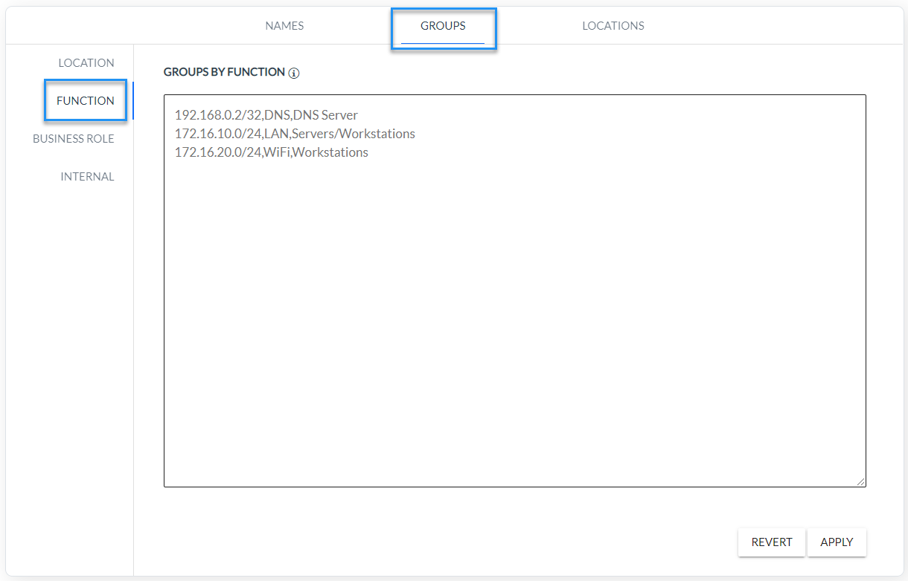

*Fig. 4.2.1 Function group configuration*

 

2. Configure XND basic module (*Fig. 4.2.2*)

  

  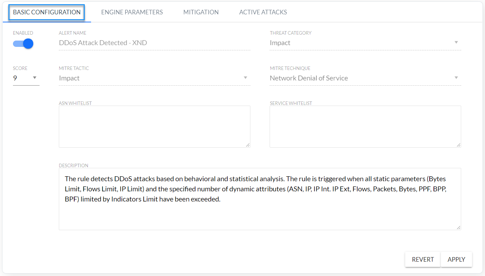

*Fig. 4.2.2 DDoS basic configuration*

 

| Rule  Attribute        | Description                                                  |
| :----------------- | :----------------------------------------------------------- |
| Enabled            | Determining whether the rule is enabled                      |
| Alert Name | The name of the rule is “DDoS Attack Detected – XND”, but the name of the alarms of this rule are START: DDoS Attack Detected  - XND" and "STOP: DDoS Attack Detected - XND". |
| Threat  Category | Threat category according to FlowControl nomenclature. |
| Score              | Criticality of alarm on a scale 1-10: 10-9 Critical, 8-7 High, 6-4 Medium, 3-2 Low. |
| MITRE Tactic | Tactical name according to MITRE technique.                  |
| MITRE  Technique   | Technique name according to MITRE technique.                 |
| ASN  Whitelist | Whitelist of source ASNs, i.e. ASNs to filtered out of by XND module mechanism. |
| Service  Whitelist | List of services excluded from the attack mitigation mechanism – alerts are still generated. Examples of Whitelist records: <br /> (1)      (Destination_IP,Port)  – blocks the selected services for specified IP address <br /> (2)      (Destination_IP,*)  – blocks all services for the specified IP address<br /> (3)      (Subnet,Port)  – blocks the service for hosts in specified subnet<br />  * means all ports |

*Table 4.2.1 XND module DDoS basic configuration*


3. Configure DDoS parameters for individual function groups (*Fig. 4.2.3, Fig. 4.2.4*)


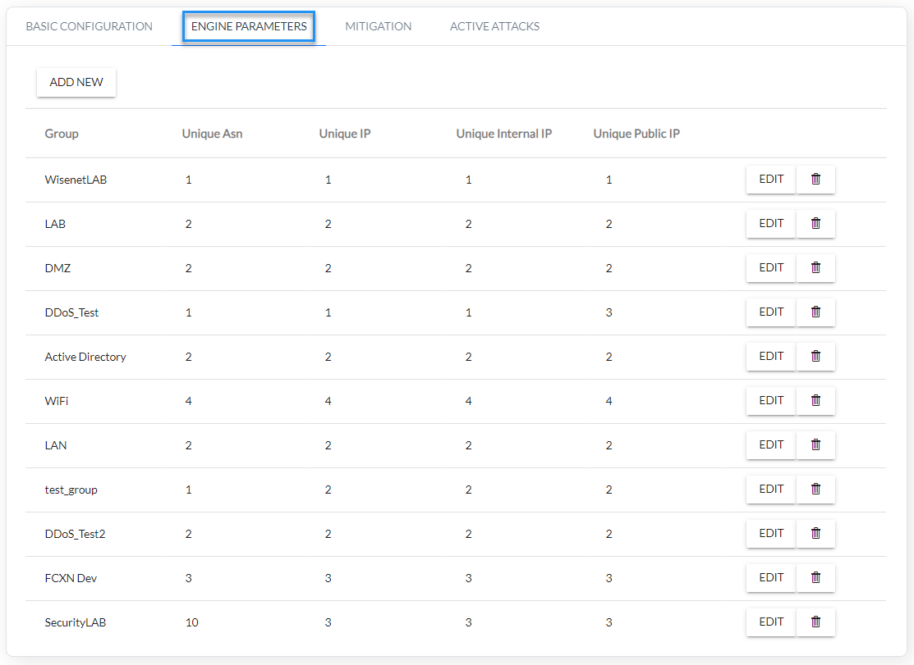


*Fig. 4.2.3 Configuration of a DDoS parameters for monitored groups.*

 

 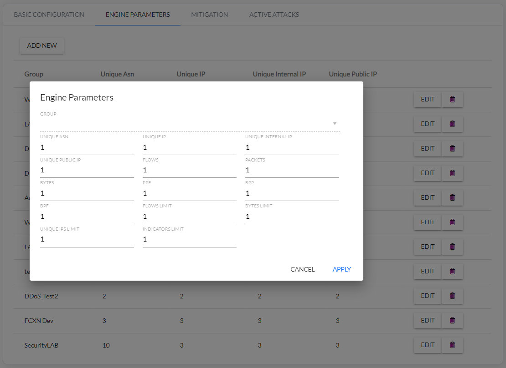


*Fig. 4.2.4 DDoS parameters configuration for selected function groups*.

 

4. Configure DDoS Mitigation (*Fig. 4.2.5*)

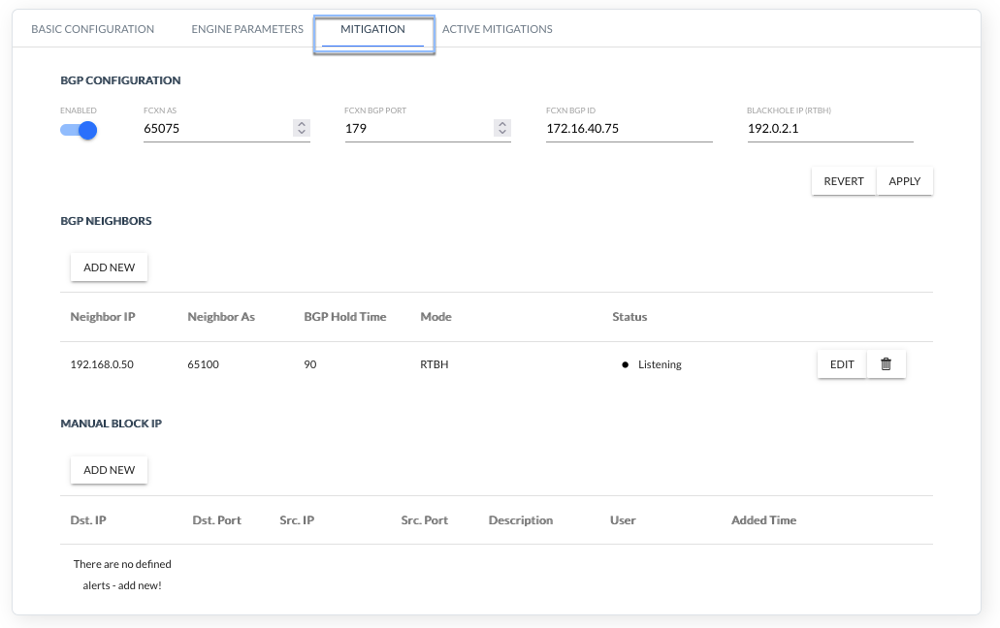

*Fig. 4.2.5 FlowSpec BGP configuration*


**BGP NEIGHBORS**

| Configuration  Attribute | Description|
|:--------------------------------   | :-----------|
| Enabled | Enabled/Disabled BGP support |
| FCXN AS    | BGP ASN number of FCXN system                                |
| FCXN BGP Port | BGP port of FCXN system                                      |
| FCXN BGP ID | BGP ID of FCXN system                                        |
| Blackhole IP (RTHB) | Blackhole IP address. Static route must be configured on the router that re-directs traffic destined to this IP to Null or discard interface. |
| Neighbor IP | IP address of the neighboring router                         |
| Neighbor AS | BGP ASN number of the neighboring router                      |
| BGP Hold Time | BGP Hold Time interval of FCXN system      |
| Mode                         | Mitigation type: FlowSpec or RTBH                            |
| Status                       | BGP connection status:<br /><u>*Listening /  Waiting for connection*</u> - System FCXN waiting for BGP connection to be initiated by the router. Not  connected: remote AS different than expected (LocalAS) – disconnected. ASN number given is different from that configured on the router.    <br /><u>*Disconnected by neighbor*</u> – BGP connection was interrupted by the router. After a few seconds the status should change to “Waiting for connection”. <br /><u>*Disconnected*</u> – BGP connection was interrupted by the FCXN system (e.g. after changing the settings). After a few seconds the status should change to  “Waiting for connection”.    <br /><u>*Disconnected: other error (report to Tech  Support)*</u> – BGP connection interrupted for other reasons. After a few seconds the status should change to  “Waiting for connection”.  <br /><u>*Connected*</u> – BGP connection established with the router. The field may contain additional information:    <br />* actual HoldTime different than expected – Hold Time parameter give in the settings is different from that configured on the router.  <br />* not sending IPv4/IPv6 AS paths – Path option is enabled, but the router is not configured to send BGP ASN tracks.   <br />* exported IPv4/IPv6 AS paths ignored – Router is configured to send BGP ASN tracks, but Paths option is disabled. Paths are ignored.   <br />* no FlowSpec IPv4/IPv6 support – FlowSpec option is enabled, but the router does not support this protocol.   <br />* FlowSpec IPv4/IPv6 support can be turned off – Router supports FlowSpec, but in FCXN settings this option is disabled. FlowSpec rules are not sent to the router. |

*Table 4.2.2 BGP FlowSpec configuration parameters*

### 

*Click the ADD NEW button and configure router* 


| Configuration  Attribute | Description                              |
| ------------------------ | ---------------------------------------- |
| Neighbor IP              | IP address of the neighboring router     |
| Neighbor AS              | BGP ASN number of the neighboring router |
| BGP Hold Time            | BGP Hold Time interval of FCXN system    |
| Paths                    | (Not implemented  yet)                   |
| Mode                     | Mitigation type: FlowSpec, RTBH or None  |

 

**MANUAL BLOK IP**

*Click the ADD NEW button and configure Manual Block IP* 


| Configuration  Attribute | Description                                  |
| :----------------------- | :------------------------------------------- |
| Dst. IP                  | Destination IP address with a mask (IP/Mask) |
| Dst. Port                | Destination port (0-65535)                   |
| Src. IP                  | Source IP address with a mask (IP/Mask)      |
| Src. Port                | Source port (0-65535)                        |
| Description              | Rule description (Text)                      |
| User                     | Filled automatically                         |
| Added Time               | Filled automatically                         |


6)   Check which services are blocked by BGP FlowSpec (*Fig. 4.2.6*).


 *Fig. 4.2.6 Displaying services blocked by* *BGB FlowSpec*


## 5. DDoS Dashboards


​	Below you find dashboards to help you analyze DDoS attacks

 

| Dashboard  Name  | Description                                                  |
| ---------------- | ------------------------------------------------------------ |
| Overview         | Visualization of general statistics on DDoS attacks.         |
| Alerts           | Table of DDoS start and end alerts. <br />START: DDoS Attack Detected – XND – launch of the attack. <br />STOP: DDoS Attack Detected – XND – end of the attack. |
| Deep  Analysis   | Table of the DDoS parameters from every minute of the attack. Exceeded threshold parameters are highlighted in red. In the lower part of the view there is an auxiliary table with threshold configurations per Group, to make it easier to monitor the causes of generated alerts. |
| Alerts Drilldown | Trends monitoring of DDoS attacks in the context of monitored DDoS parameters from each minute of the attack in the form of a graph on which you can select the DDoS attack parameter. |
| Statistics       | Trends monitoring of DDoS attacks in the context of monitored DDoS parameters from each minute in the form of a series of graphs, which facilitate the analysis of DDoS attacks. |
| Details          | Details information on DDoS attacks i.e. source IP address, destination IP address, geographical location. |

*Table 5.1* *DDoS dashboards list*

 


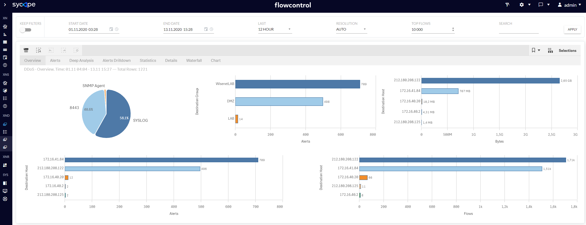

*Fig. 5.1 DDoS Overview*

  

*Fig. 5.2 DDoS Alerts*

 

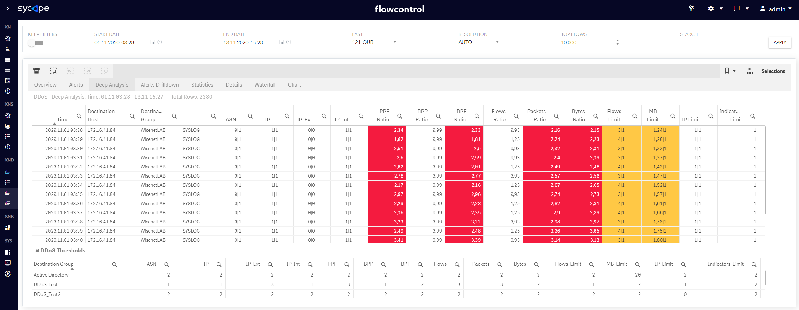

*Fig. 5.3 DDoS Deep Analysis*

 


*Fig. 5.4 DDoS Alerts Drilldown*


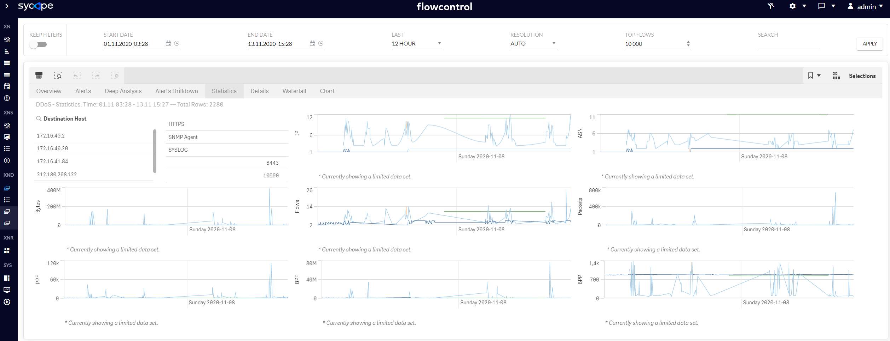

*Fig. 5.5 DDoS Statistics*

 

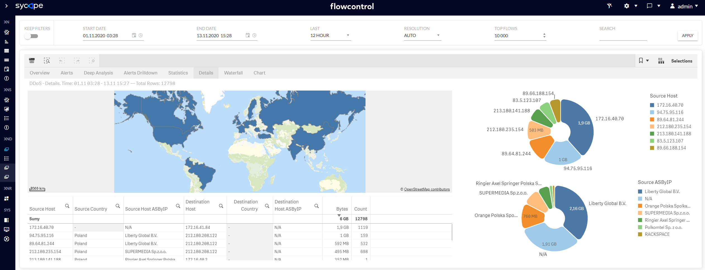

*Fig. 5.6 DDoS Details*


​                                                      